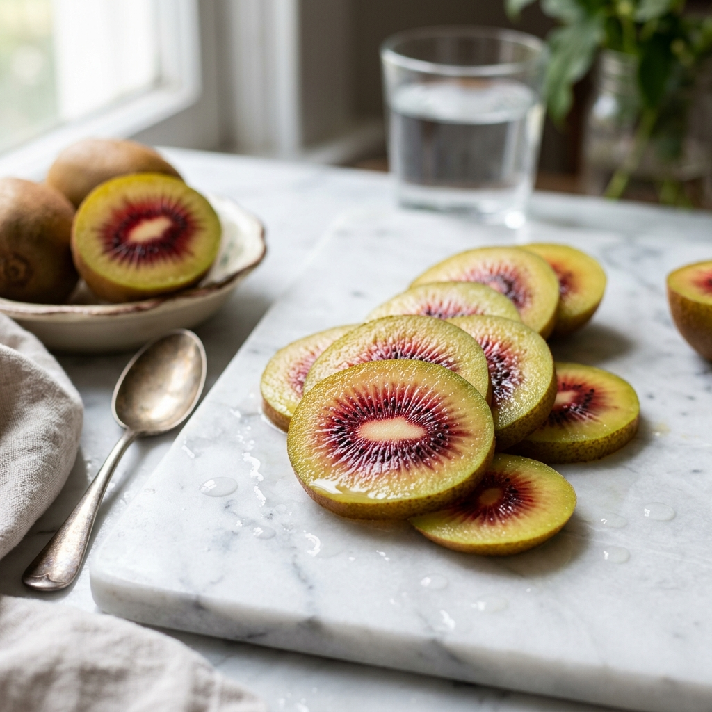

[style.css](https://github.com/user-attachments/files/27080386/style.css)
:root {
    --primary-red: #D1001C;
    --dark-red: #8B0000;

    --kiwi-green: #8EBC45;
    --soft-white: #FDFDFD;
    --dark-text: #1A1A1A;
    --light-gray: #F4F4F4;
    --gold: #D4AF37;
    --transition: all 0.4s cubic-bezier(0.165, 0.84, 0.44, 1);
}

* {
    margin: 0;
    padding: 0;
    box-sizing: border-box;
}

body {
    font-family: 'Noto Sans KR', sans-serif;
    background-color: var(--soft-white);
    color: var(--dark-text);
    line-height: 1.6;
    overflow-x: hidden;
}

h1, h2, h3, .logo {
    font-family: 'Outfit', sans-serif;
}

.container {
    max-width: 1200px;
    margin: 0 auto;
    padding: 0 2rem;
}

/* Header & Nav */
header {
    position: fixed;
    top: 0;
    width: 100%;
    z-index: 1000;
    padding: 1.5rem 0;
    transition: var(--transition);
}

header.scrolled {
    background: rgba(255, 255, 255, 0.9);
    backdrop-filter: blur(10px);
    padding: 1rem 0;
    box-shadow: 0 4px 30px rgba(0, 0, 0, 0.05);
}

nav {
    display: flex;
    justify-content: space-between;
    align-items: center;
}

.logo {
    font-size: 1.8rem;
    font-weight: 800;
    color: var(--primary-red);
    letter-spacing: -1px;
}

.logo span {
    color: var(--kiwi-green);
}

.nav-links {
    display: flex;
    list-style: none;
    gap: 2.5rem;
}

.nav-links a {
    text-decoration: none;
    color: var(--dark-text);
    font-weight: 600;
    font-size: 1rem;
    transition: var(--transition);
}

.nav-links a:hover {
    color: var(--primary-red);
}

.lang-switch {
    background: var(--primary-red);
    color: white !important;
    padding: 0.4rem 0.8rem;
    border-radius: 6px;
    font-size: 0.8rem !important;
}

/* Hamburger Menu (Hidden by default) */
.mobile-menu-btn {
    display: none;
    flex-direction: column;
    gap: 6px;
    cursor: pointer;
    z-index: 1001;
}

.mobile-menu-btn span {
    width: 25px;
    height: 2px;
    background: var(--dark-text);
    transition: var(--transition);
}

/* Hero Section */
#hero {
    padding: 12rem 0 8rem;
    background: radial-gradient(circle at 80% 20%, rgba(209, 0, 28, 0.05) 0%, rgba(142, 188, 69, 0.05) 100%);
    min-height: 100vh;
    display: flex;
    align-items: center;
}

.hero-content {
    display: flex;
    align-items: center;
    gap: 4rem;
}

.hero-text {
    flex: 1;
}

.badge {
    display: inline-block;
    padding: 0.5rem 1.2rem;
    background: var(--primary-red);
    color: white;
    border-radius: 50px;
    font-size: 0.85rem;
    font-weight: 700;
    margin-bottom: 1.5rem;
    box-shadow: 0 4px 15px rgba(209, 0, 28, 0.2);
}

h1 {
    font-size: 4rem;
    line-height: 1.1;
    margin-bottom: 2rem;
    font-weight: 800;
    color: var(--dark-text);
}

.accent {
    color: var(--primary-red);
    position: relative;
}

.hero-text p {
    font-size: 1.2rem;
    color: #555;
    margin-bottom: 2.5rem;
    font-weight: 300;
}

.btn {
    display: inline-block;
    padding: 1.2rem 2.5rem;
    border-radius: 50px;
    text-decoration: none;
    font-weight: 700;
    transition: var(--transition);
    cursor: pointer;
}

.btn-primary {
    background: var(--primary-red);
    color: white;
    box-shadow: 0 10px 30px rgba(209, 0, 28, 0.3);
}

.btn-primary:hover {
    transform: translateY(-5px);
    box-shadow: 0 15px 40px rgba(209, 0, 28, 0.4);
}

.hero-image {
    flex: 1;
    position: relative;
}

.hero-image img {
    width: 100%;
    height: auto;
    border-radius: 30px;
    box-shadow: 0 20px 60px rgba(0, 0, 0, 0.1);
    animation: float 6s ease-in-out infinite;
}

@keyframes float {
    0%, 100% { transform: translateY(0); }
    50% { transform: translateY(-20px); }
}

/* Grid Cards */
#about {
    padding: 8rem 0;
}

.section-title {
    text-align: center;
    margin-bottom: 5rem;
}

.section-title h2 {
    font-size: 2.5rem;
    margin-bottom: 1rem;
}

.grid-cards {
    display: grid;
    grid-template-columns: repeat(auto-fit, minmax(300px, 1fr));
    gap: 2.5rem;
}

.card {
    background: white;
    padding: 3rem 2rem;
    border-radius: 24px;
    text-align: center;
    transition: var(--transition);
    border: 1px solid rgba(0,0,0,0.03);
}

.card:hover {
    transform: translateY(-10px);
    box-shadow: 0 30px 60px rgba(0,0,0,0.08);
    border-color: var(--primary-red);
}

.card .icon {
    font-size: 3rem;
    margin-bottom: 1.5rem;
}

.card h3 {
    font-size: 1.5rem;
    margin-bottom: 1rem;
    color: var(--primary-red);
}

/* Nutrition Section */
#nutrition {
    padding: 8rem 0;
    background-color: var(--light-gray);
}

.nutrition-wrapper {
    display: flex;
    align-items: center;
    gap: 5rem;
}

.nutrition-content {
    flex: 1;
}

.nutrition-content h2 {
    font-size: 3rem;
    margin-bottom: 3rem;
}

.benefit-list {
    list-style: none;
}

.benefit-list li {
    margin-bottom: 2.5rem;
    padding-left: 1.5rem;
    border-left: 4px solid var(--kiwi-green);
}

.benefit-list strong {
    display: block;
    font-size: 1.3rem;
    margin-bottom: 0.5rem;
    color: var(--dark-text);
}

.nutrition-visual {
    flex: 1;
}

.visual-placeholder {
    width: 100%;
    height: 500px;
    background: linear-gradient(135deg, var(--primary-red), var(--kiwi-green));
    border-radius: 30px;
    opacity: 0.2;
}

/* Footer */
footer {
    padding: 4rem 0;
    background: #000;
    color: white;
    text-align: center;
}

.footer-content .logo {
    margin-bottom: 1.5rem;
}

/* Mobile Responsive */
@media (max-width: 1024px) {
    h1 {
        font-size: 3.2rem;
    }
    
    .hero-content {
        gap: 2rem;
    }
}

@media (max-width: 768px) {
    header {
        padding: 1rem 0;
    }

    .mobile-menu-btn {
        display: flex;
    }

    .nav-links {
        position: fixed;
        top: 0;
        right: -100%;
        width: 70%;
        height: 100vh;
        background: white;
        flex-direction: column;
        justify-content: center;
        align-items: center;
        transition: 0.5s ease;
        box-shadow: -10px 0 30px rgba(0,0,0,0.1);
    }

    .nav-links.active {
        right: 0;
    }

    .hero-content {
        flex-direction: column-reverse;
        text-align: center;
        padding-top: 4rem;
    }
    
    h1 {
        font-size: 2.5rem;
    }
    
    .hero-text p {
        font-size: 1rem;
    }

    .nutrition-wrapper {
        flex-direction: column;
        gap: 3rem;
    }

    .nutrition-content h2 {
        font-size: 2.2rem;
    }
}

@media (max-width: 480px) {
    h1 {
        font-size: 2rem;
    }

    .hero-btns {
        display: flex;
        flex-direction: column;
        gap: 1rem;
    }

    .btn {
        width: 100%;
        text-align: center;
    }
}

<!DOCTYPE html>
<html lang="en">
<head>
    <meta charset="UTF-8">
    <meta name="viewport" content="width=device-width, initial-scale=1.0">
    <title>RubyRed Kiwi - Nature's Red Jewel</title>
    <meta name="description" content="Discover the premium RubyRed Kiwi with its berry-sweet flavor, stunning ruby center, and rich Vitamin C content.">
    <link rel="stylesheet" href="style.css">
    <link rel="preconnect" href="https://fonts.googleapis.com">
    <link rel="preconnect" href="https://fonts.gstatic.com" crossorigin>
    <link href="https://fonts.googleapis.com/css2?family=Outfit:wght@300;400;600;800&family=Noto+Sans+KR:wght@300;400;700&display=swap" rel="stylesheet">
</head>
<body>
    <header id="header">
        <nav class="container">
            
RubyRed

            

                
                
                
            

            <ul class="nav-links" id="nav-links">
                <li><a href="#hero">Home</a></li>
                <li><a href="#about">Product Info</a></li>
                <li><a href="#footer">Contact</a></li>
                <li><a href="rubyredkiwi.html" class="lang-switch">KO</a></li>
            </ul>
        </nav>
    </header>

    <section id="hero">
        

            

                Seasonal Premium
                <h1>Nature's Red Jewel, Ruby Kiwi</h1>
                
Sweet as a strawberry, refreshing as a kiwi. Start a completely new flavor experience like no other.

                

                    <a href="#about" class="btn btn-primary">Learn More</a>
                

            

            

                
            

        

    </section>

    <section id="about" class="container">
        

            <h2>What Makes It Special?</h2>
            
The unique charm of RubyRed Kiwi

        

        

            

                
💎

                <h3>Stunning Red Core</h3>
                
The vibrant ruby color at the center is a natural trait born from over 20 years of research and natural breeding.

            

            

                
🍓

                <h3>Berry-Sweet Flavor</h3>
                
Less acidic than traditional kiwis, it carries a sweet aroma reminiscent of strawberries and blueberries.

            

            

                
✨

                <h3>Limited Seasonal Value</h3>
                
A high-premium variety that can only be enjoyed during a short window in the spring season.

            

        

    </section>

    <section id="nutrition">
        

            

                <h2>Powerhouse of Nutrition</h2>
                <ul class="benefit-list">
                    <li>
                        <strong>Rich in Anthocyanins</strong>
                        
The red pigments are powerful antioxidants that help prevent aging and support cardiovascular health.

                    </li>
                    <li>
                        <strong>King of Vitamin C</strong>
                        
Just one kiwi provides the full daily recommended intake of Vitamin C for an adult.

                    </li>
                    <li>
                        <strong>Abundant Dietary Fiber</strong>
                        
Packed with fiber to support digestive health and a light, energetic day.

                    </li>
                </ul>
            

            

                

            

        

    </section>

    <footer id="footer">
        

            

                
RubyRed

                
Email: contact@rubyredkiwi.com | Phone: +82-2-1234-5678

                
&copy; 2026 RubyRed Kiwi Premium. All rights reserved.

            

        

    </footer>

    
</body>
</html>

window.addEventListener('scroll', () => {
    const header = document.querySelector('header');
    if (window.scrollY > 50) {
        header.classList.add('scrolled');
    } else {
        header.classList.remove('scrolled');
    }
});

// Smooth scroll and close mobile menu
document.querySelectorAll('a[href^="#"]').forEach(anchor => {
    anchor.addEventListener('click', function (e) {
        e.preventDefault();
        
        // Close mobile menu if open
        const navLinks = document.getElementById('nav-links');
        navLinks.classList.remove('active');

        document.querySelector(this.getAttribute('href')).scrollIntoView({
            behavior: 'smooth'
        });
    });
});

// Mobile menu toggle
const mobileMenuBtn = document.getElementById('mobile-menu-btn');
const navLinks = document.getElementById('nav-links');

mobileMenuBtn.addEventListener('click', () => {
    navLinks.classList.toggle('active');
});

<!DOCTYPE html>
<html lang="ko">
<head>
    <meta charset="UTF-8">
    <meta name="viewport" content="width=device-width, initial-scale=1.0">
    <title>루비레드키위 - 자연이 빚은 붉은 보석</title>
    <meta name="description" content="달콤한 베리 향과 루비처럼 빛나는 붉은 과육, 비타민 C가 풍부한 프리미엄 루비레드키위를 만나보세요.">
    <link rel="stylesheet" href="style.css">
    <link rel="preconnect" href="https://fonts.googleapis.com">
    <link rel="preconnect" href="https://fonts.gstatic.com" crossorigin>
    <link href="https://fonts.googleapis.com/css2?family=Outfit:wght@300;400;600;800&family=Noto+Sans+KR:wght@300;400;700&display=swap" rel="stylesheet">
</head>
<body>
    <header id="header">
        <nav class="container">
            
RubyRed

            

                
                
                
            

            <ul class="nav-links" id="nav-links">
                <li><a href="#hero">홈페이지</a></li>
                <li><a href="#about">제품 정보</a></li>
                <li><a href="#footer">문의</a></li>
                <li><a href="rubyredkiwi_en.html" class="lang-switch">EN</a></li>
            </ul>
        </nav>
    </header>

    <section id="hero">
        

            

                시즌 한정 프리미엄
                <h1>자연이 빚은 붉은 보석, 루비키위</h1>
                
딸기처럼 달콤하고 키위처럼 상큼한, 세상에 없던 전혀 새로운 맛의 경험을 시작하세요.

                

                    <a href="#about" class="btn btn-primary">더 알아보기</a>
                

            

            

                
            

        

    </section>

    <section id="about" class="container">
        

            <h2>무엇이 다른가요?</h2>
            
루비레드키위만이 가진 특별한 매력

        

        

            

                
💎

                <h3>눈부신 붉은 빛</h3>
                
과육 중심부의 선명한 루비색은 인위적인 조작 없이 자연 교배를 통해 탄생한 고유의 색상입니다.

            

            

                
🍓

                <h3>베리-스위트 풍미</h3>
                
기존 키위보다 신맛은 줄이고, 딸기와 블루베리를 닮은 달콤한 향을 가득 담았습니다.

            

            

                
✨

                <h3>시즌 한정의 가치</h3>
                
일 년 중 오직 봄철에만 맛볼 수 있는 희소성 높은 프리미엄 품종입니다.

            

        

    </section>

    <section id="nutrition">
        

            

                <h2>작은 열매 속, 거대한 영양</h2>
                <ul class="benefit-list">
                    <li>
                        <strong>안토시아닌 함유</strong>
                        
붉은 색소인 안토시아닌은 강력한 항산화 작용으로 노화 방지와 혈관 건강을 돕습니다.

                    </li>
                    <li>
                        <strong>비타민 C의 왕</strong>
                        
단 한 알로 성인 일일 권장 섭취량을 충족하는 놀라운 비타민 함유량을 자랑합니다.

                    </li>
                    <li>
                        <strong>풍부한 식이섬유</strong>
                        
장 건강을 책임지는 식이섬유가 가득해 가벼운 하루를 선물합니다.

                    </li>
                </ul>
            

            

                <!-- 추가 이미지가 들어갈 자리 -->
                

            

        

    </section>

    <footer id="footer">
        

            

                
RubyRed

                
&copy; 2026 RubyRed Kiwi Premium. All rights reserved.

            

        

    </footer>

    
</body>
</html>
